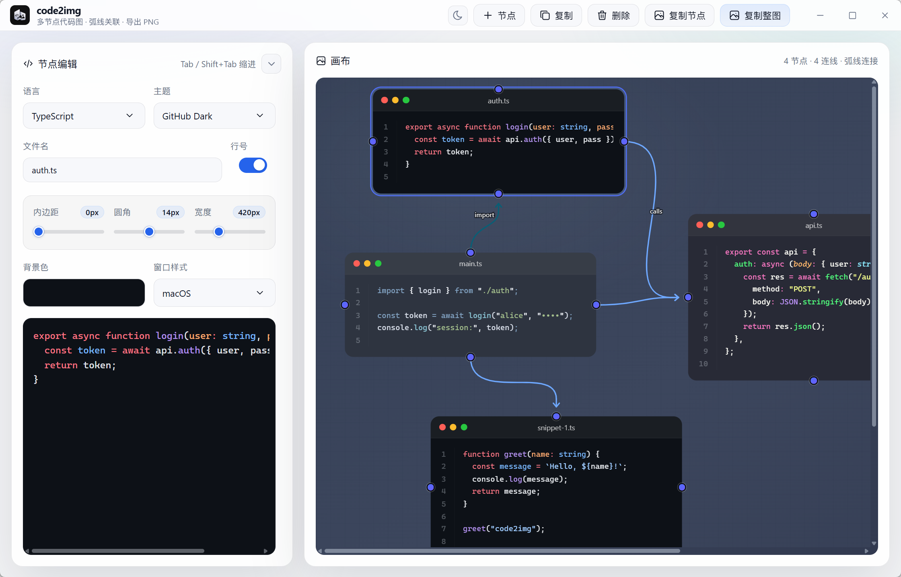
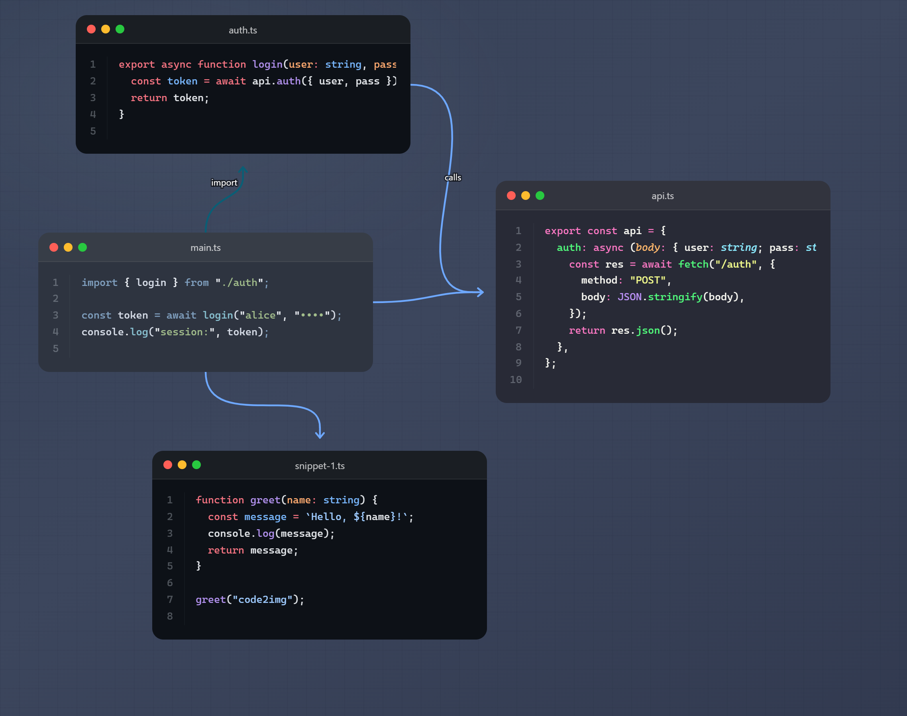
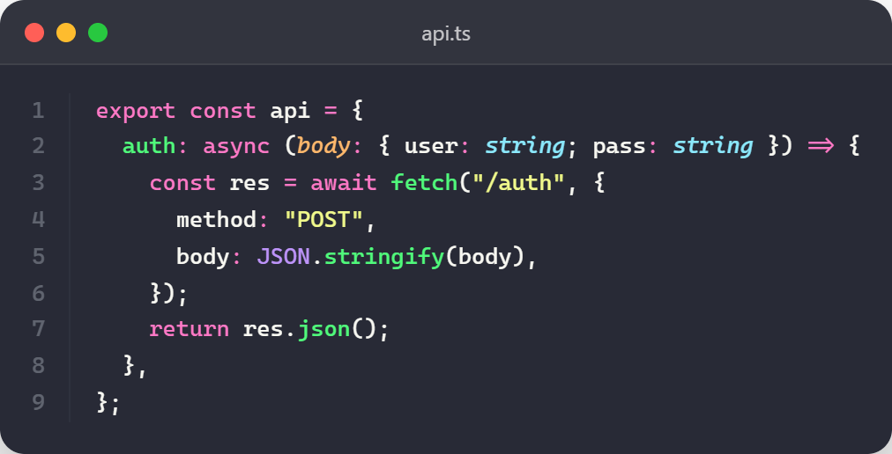

<h1 align="center">code2img</h1>

把代码片段编排成一张可分享的关系图。code2img 是一个用 **Tauri 2 + React + TypeScript** 构建的桌面应用，支持多代码节点、弧线连接、语法高亮主题和高清 PNG 导出。



## 预览

### 导出整图



### 复制单图



## 特性

- **多节点画布**：在同一画布中自由摆放多个代码卡片
- **弧线关联**：从节点锚点拖拽连线，表达调用、依赖、导入等关系
- **节点编辑**：左侧直接编辑代码，支持文件名、语言、主题、行号和窗口样式
- **缩进友好**：支持 `Tab` / `Shift+Tab` 对单行或多行代码缩进
- **细节可调**：可调整内边距、圆角、宽度、背景色等视觉参数
- **高亮主题**：基于 Shiki 提供多语言语法高亮和多套代码主题
- **一键导出**：支持复制单个节点或复制整图，导出适合文档、文章、PPT 的 PNG

## 适合场景

- 解释一段代码如何调用另一段代码
- 为技术文章、教程、README 制作代码配图
- 展示模块依赖、数据流、接口调用链
- 把零散代码片段整理成更直观的视觉说明

## 下载

Windows release 包构建后会生成：

- NSIS 安装包：`src-tauri/target/release/bundle/nsis/code2img_0.1.2_x64-setup.exe`
- MSI 安装包：`src-tauri/target/release/bundle/msi/code2img_0.1.2_x64_en-US.msi`
- 免安装可执行文件：`src-tauri/target/release/code2img.exe`

## 本地开发

环境要求：

- Node.js 22+
- Rust stable
- Windows 需要 WebView2 与 MSVC 构建工具

安装依赖：

```bash
npm install
```

启动桌面应用：

```bash
npm run tauri:dev
```

仅启动前端预览：

```bash
npm run dev
```

## 打包

构建 Windows release 包：

```bash
npm run tauri:build
```

如果 Cargo 下载依赖时受到系统代理影响，项目内的 `.cargo/config.toml` 会让当前项目绕过系统代理配置。

## 技术栈

| 模块 | 技术 |
| --- | --- |
| 桌面应用 | Tauri 2 |
| 前端框架 | React 19 |
| 构建工具 | Vite |
| 语言 | TypeScript |
| 代码高亮 | Shiki |
| 图片导出 | modern-screenshot |

## License

MIT License
